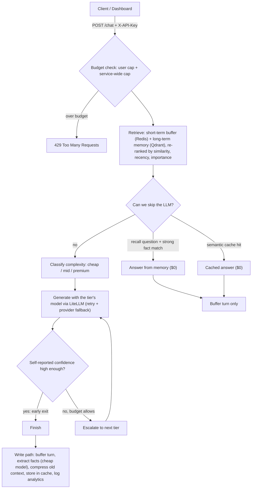

# CostMind
**A memory-enabled, cost-aware conversational agent.** It remembers users across sessions *and* routes every request to the cheapest model that can handle it — skipping the LLM entirely when memory or a semantic cache already has the answer.
> **Live demo:** `<your-dashboard>.onrender.com`  |  **API docs:** `<your-api>.onrender.com/docs`
> (Free tier: the first request after 15 idle minutes takes ~1 minute to wake the service.)
## Results
Measured by `python -m benchmarks.run_benchmark --judge --sweep` on **320 queries** (60% simple / 30% medium / 10% complex, ~25% near-duplicates, personal-fact recall scenarios, a few long-running "power users").
Baseline = always the premium model with each user's full conversation history. CostMind totals include escalations, memory upkeep (summaries, fact extraction) and embeddings.
| Metric | Baseline | CostMind | Result |
|---|---|---|---|
| Total cost | $— | $— | **X = —% cheaper** |
| Prompt tokens | — | — | **Y = —%** |
| LLM calls avoided | 0% | —% | **Z = —%** |
| Avg latency | — ms | — ms | |
| Memory-recall accuracy | —% | —% | |
| Answer quality (LLM judge, 1-5) | — | — | —% retained |
*CostMind cost includes chat inference, memory maintenance (summaries/fact extraction) and embeddings.* The benchmark is the authoritative measurement; dashboard savings are estimates based on the configured premium model.
Benchmark breakdown: CostMind chat cost = $0.204615, maintenance = $0.008685, embeddings = $0.000197; 233 memory extractions were skipped and 59 context compressions were performed.
## How a request flows

## Features
**Memory** — sliding-window short-term buffer; long-term vector recall with relevance scoring (`0.6·similarity + 0.25·recency + 0.15·importance`, exponential recency decay); context compression by summarizing old turns with a cheap model; fact extraction with deduplication; per-user isolation; "forget me" endpoint.
**Cost control** — heuristic complexity classifier; three-tier model ladder; confidence-based early exit; per-request, per-user-daily and **service-wide** daily USD caps; low-budget degradation (cheap tier only, fewer memories retrieved); automatic retry and cross-provider fallback.
**Memory × cost (the interesting part)** — recall questions ("what is my name?") are answered straight from memory at $0; a privacy-scoped semantic cache (answers that used personal memory stay private to that user); cheap model does all memory upkeep; fact extraction is gated so "What is DNS?" never pays for an extraction call.
**Observability** — per-request analytics (model, tier, tokens, cost, latency, route, estimated premium baseline) in SQLite; `/metrics`; Streamlit dashboard. The raw message is never stored.
## Quickstart (local)
```bash
python -m venv venv && source venv/bin/activate        # Windows: venv\Scripts\activate
pip install -r requirements-dev.txt
cp .env.example .env                                   # add OPENAI_API_KEY (optional: works offline with a mock LLM)
docker compose up -d                                   # Qdrant + Redis
uvicorn app.main:app --reload --port 8000              # API  -> http://localhost:8000/docs
# second terminal, separate virtualenv recommended
pip install -r dashboard/requirements.txt
streamlit run dashboard/app.py                         # dashboard -> http://localhost:8501
pytest                                                 # 71 tests, no network or API key needed
```
Everything in one go: `docker compose --profile app up --build`.
```bash
curl -X POST localhost:8000/chat -H "Content-Type: application/json" \
  -d '{"user_id":"rahul","message":"Hi, I am Rahul and I love cricket"}'
curl -X POST localhost:8000/chat -H "Content-Type: application/json" \
  -d '{"user_id":"rahul","message":"what is my name?"}'      # answered from memory, cost $0
```
## API
| Method & path | Purpose |
|---|---|
| `POST /chat` | `{user_id, message}` → reply + model, route path/reason, confidence, cost, tokens, `cache_hit`, `answered_from_memory` |
| `GET /memory/{user_id}?q=&k=` | list memories, or recall top-k for a query |
| `DELETE /memory/{user_id}` | forget me: memories, buffer, private cache entries, analytics rows |
| `GET /metrics`, `/metrics/recent` | aggregated analytics / latest per-request rows |
| `GET /stats/agent`, `/stats/memory` | in-process counters |
| `GET /health`, `/health/deps` | liveness / readiness (always unauthenticated) |
If `API_KEY` is set, every endpoint except `/health*` requires the header `X-API-Key`.
## Configuration (env vars)
| Variable | Default | Notes |
|---|---|---|
| `OPENAI_API_KEY` / `ANTHROPIC_API_KEY` | – | With neither, the offline mock LLM is used |
| `CHEAP_MODEL` / `MID_MODEL` / `PREMIUM_MODEL` | gpt-4o-mini / gpt-4o-mini / gpt-4o | any LiteLLM model string; duplicate tiers are skipped when escalating |
| `FALLBACK_MODELS` | – | comma-separated, tried when a provider call fails |
| `CONFIDENCE_THRESHOLD` | 0.75 | early-exit bar |
| `CACHE_SIMILARITY_THRESHOLD` / `CACHE_TTL_HOURS` | 0.92 / 24 | |
| `MEMORY_ANSWER_THRESHOLD` | 0.5 | min similarity to answer a recall question without an LLM; tune with the benchmark |
| `MAX_USD_PER_USER_PER_DAY` / `MAX_USD_GLOBAL_PER_DAY` / `MAX_USD_PER_REQUEST` | 0.50 / 2.00 / 0.05 | |
| `API_KEY` | – | set in production |
| `QDRANT_URL`, `QDRANT_API_KEY`, `REDIS_URL` | localhost | `QDRANT_URL=:memory:` for an embedded store |
## Deploy to Render (free tier)
1. **Qdrant Cloud:** create a free cluster; note the URL and API key.
2. Push this repo to GitHub.
3. Render → **New + → Blueprint** → select the repo. `render.yaml` creates the API, the dashboard and a free Key Value (Redis) instance, wires `REDIS_URL` and the generated `API_KEY` automatically, and asks you for the secrets: `OPENAI_API_KEY`, `QDRANT_URL`, `QDRANT_API_KEY`, and `API_URL` (the API's public URL, e.g. `https://costmind-api.onrender.com`).
4. Verify: `python -m scripts.smoke_test https://costmind-api.onrender.com --api-key <API_KEY from the Render dashboard>`.
Before deploying, run `python -m scripts.preflight` with the production variables set; it flags missing keys, localhost URLs and unsafe settings.
**Free-tier realities:** 512 MB RAM / 0.1 CPU (measured peak with LiteLLM loaded: ~270 MB); services sleep after 15 minutes idle and take about a minute to wake; the 750 free instance hours are shared across your whole workspace; Key Value and the filesystem are **not persistent**, so short-term buffers, daily-spend counters and analytics history reset on restart. Long-term memory lives in Qdrant Cloud and survives.
**Public-demo safety:** the API is key-protected, user ids and message sizes are validated, and spend is capped per user and service-wide. The dashboard's live-chat box is open to visitors, so it spends your credit up to the global cap; set `ENABLE_LIVE_CHAT=false` on the dashboard to disable it.
## Design decisions
- **Cache scoping is a privacy decision.** Answers generated without personal memory are shared; answers that used a user's memories are cached privately. Time-sensitive, context-dependent and first-person messages are never cached.
- **Savings are measured against a fair baseline** (premium model, full history, same brevity instruction), and CostMind is charged for its own overhead: escalations, memory upkeep and embeddings.
- **Heuristic router first.** The complexity classifier is free and instant; the benchmark's threshold sweep shows what an LLM classifier would have to beat.
- **Qdrant doubles as the cache store** (native ANN search); Redis handles the short-term buffer and budget counters.
- **API embeddings, lazy LiteLLM import, background warm-up** keep the service inside 512 MB.
## Limitations (honest)
- Confidence is self-reported by the model and can be miscalibrated; the benchmark sweeps the threshold, but it isn't a calibrated probability.
- The classifier is keyword/length heuristics, so it will misroute some queries.
- The dashboard's savings figure is an *estimate* (one premium call with the same final prompt); the benchmark is the authoritative measurement.
- One shared API key, no per-user auth; no horizontal scaling story beyond Redis/Qdrant being external.
- Context compression and fact extraction are not transactional; concurrent requests for one user can interleave.
## Layout
```
app/        main.py (API) · graph.py (LangGraph agent) · router.py · budget.py · cache.py · memory_router.py
            analytics.py · llm.py · factory.py · memory/{short_term,long_term,scoring,maintenance,manager,embeddings}.py
dashboard/  Streamlit app (+ its own requirements and Dockerfile)
benchmarks/ generate_queries.py · run_benchmark.py · queries.json
scripts/    preflight.py · smoke_test.py
tests/      71 tests (offline: mock LLM, in-memory Qdrant)
```
MIT licensed.